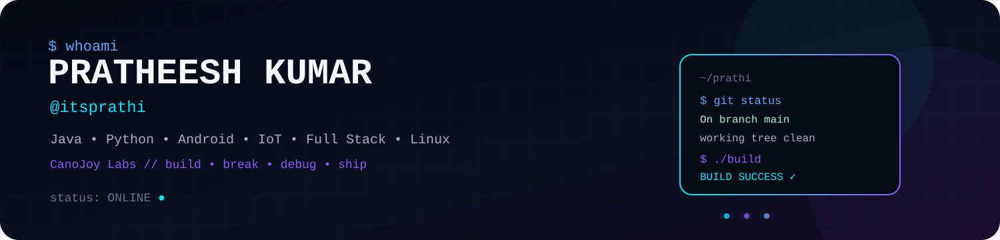
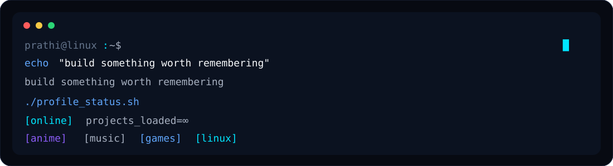
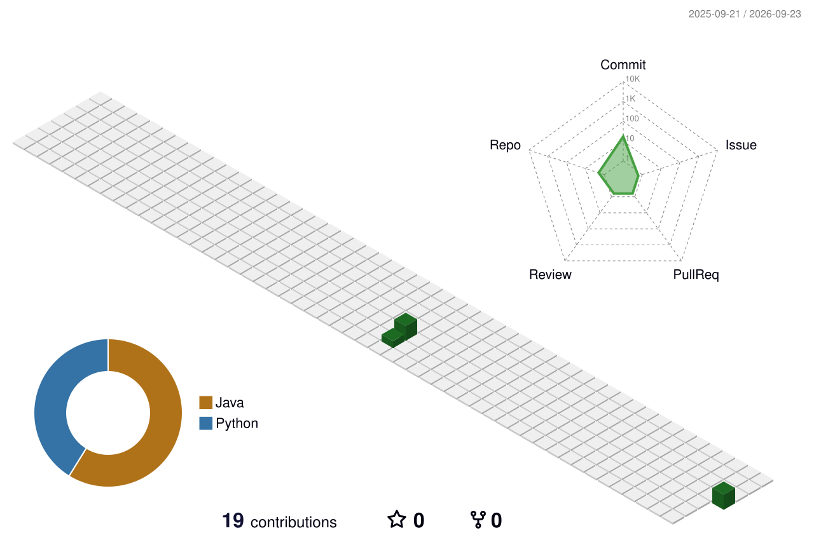
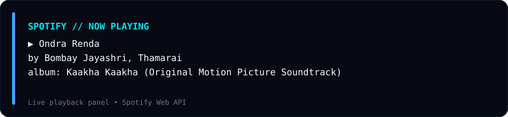
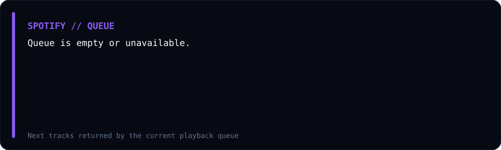
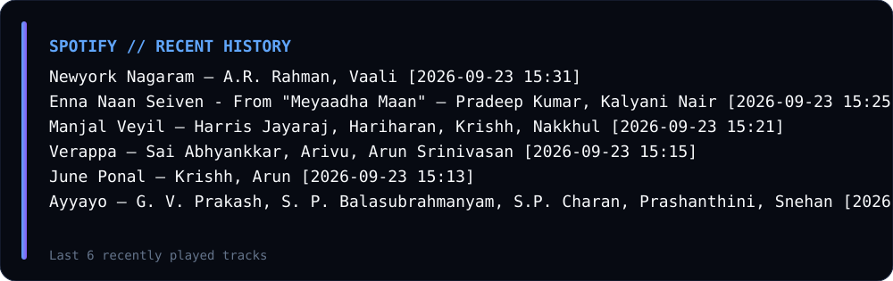
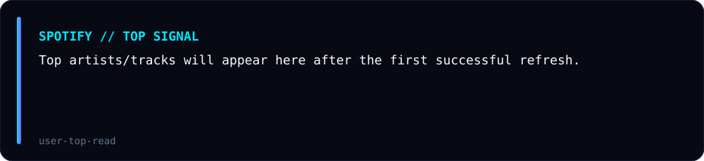
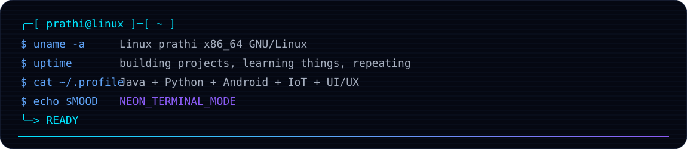
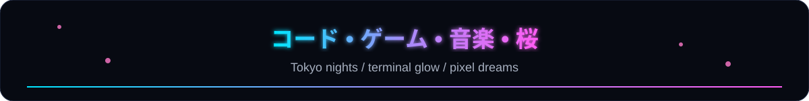

<!--
╔══════════════════════════════════════════════════════════════════════════════╗
║  ITSPRATHI // PROFILE README                                                ║
║  Maximal dark / neon / terminal / anime / arcade edition                    ║
║                                                                              ║
║  Everything is intentionally included. Delete/comment sections later.      ║
╚══════════════════════════════════════════════════════════════════════════════╝
-->

<div align="center">



<br>

[](https://git.io/typing-svg)

<p>
  <a href="https://github.com/itsprathi"></a>
  <a href="https://www.linkedin.com/in/pratheeshkumarg"></a>
  <a href="https://www.instagram.com/its.prathi"></a>
  <br>
  
</p>

</div>

---

## `> whoami`

```text
┌──────────────────────────────────────────────────────────────────────────────┐
│ USER       : prathi                                                          │
│ NAME       : PRATHEESH KUMAR                                                 │
│ HANDLE     : @itsprathi                                                      │
│ ROLE       : Tech Enthusiast / Developer                                     │
│ STACK      : Java • Python • Web • Android • IoT • Spring Boot               │
│ CURRENT    : Building, learning, experimenting, breaking, fixing             │
│ PUBLISHER  : CanoJoy Labs                                                    │
│ DOMAIN     : canojoy.com                                                     │
│ SYSTEM     : Linux + terminal + caffeine                                     │
└──────────────────────────────────────────────────────────────────────────────┘
```

> **Tech enthusiast with hands-on experience in Android, IoT, full stack web development, and UI/UX design.**  
> I like turning ideas into working software, experimenting with hardware, and making technical projects feel like products instead of assignments.

<div align="center">



</div>

---

## `// about.prathi`

<table>
<tr>
<td width="52%" valign="top">

### ⚡ Core profile

- 🎓 B.Tech in Information Technology — **Agni College of Technology**
- ☕ Strong focus on **Java**, OOP, DSA, JDBC, SQL and backend fundamentals
- 📱 Android development with **Java**
- 🌐 Full-stack web development
- 🔌 IoT + hardware experimentation
- 🎨 UI/UX with **Figma, Photoshop and Canva**
- 🐧 Linux + terminal workflows
- ☁️ Cloud / REST / Firebase / JSON / XML
- 🤝 Problem solving, collaboration, communication and leadership
- 🧪 I enjoy building weird experiments just because they are fun

</td>
<td width="48%" valign="top">

### 🧩 Current interests

```text
[████████████████░░] Java / Spring Boot
[██████████████░░░░] DSA
[████████████░░░░░░] SQL / DBMS
[███████████░░░░░░░] Android
[██████████░░░░░░░░] IoT / ESP32
[██████████░░░░░░░░] Full Stack
[████████░░░░░░░░░░] UI / UX
[████████░░░░░░░░░░] Linux
```

### 🧠 Motto

> `learn → build → break → debug → rebuild → ship`

</td>
</tr>
</table>

---

## `> terminal --session prathi`

```bash
$ neofetch --user
OS:        Linux / Windows
SHELL:     bash / PowerShell
EDITOR:    VS Code / Android Studio
LANG:      Java • Python • JavaScript
BACKEND:   Spring Boot • Node.js • Express
DATA:      Oracle SQL • MongoDB
MOBILE:    Android • Flutter
TOOLS:     Git • GitHub • Figma
MOOD:      ████████████████████ 100%
STATUS:    ONLINE // BUILDING
```

<details>
<summary><b>🐧 Linux terminal easter egg</b></summary>

```text
prathi@linux:~$ sudo make coffee
[sudo] password for prathi: ********
coffee: compiling...
coffee: linking...
coffee: BUILD SUCCESS

prathi@linux:~$ git status
On branch main
nothing to commit, working tree clean

prathi@linux:~$ ./motivation
Segmentation fault (core dumped)

prathi@linux:~$ cat /etc/skillset
Java
Python
JavaScript
SQL
Linux
Android
IoT
UI/UX
```

</details>

---

## `// skills.json`

### Languages

<p>

</p>

### Frameworks / Tools

<p>

</p>

### Databases / Cloud / Systems

<p>

</p>

### Design

<p>

</p>

<p>


</p>

---

## `// stack matrix`

| Area | Technologies |
|---|---|
| Programming | Java, Python, HTML, CSS, JavaScript |
| Frameworks & Tools | Spring Boot, Flutter, Git, GitHub, VS Code, Android Studio |
| Databases | Oracle SQL, MongoDB |
| Technologies | REST APIs, Firebase, JSON, XML, Cloud Services, Linux |
| UI / UX | Figma, Adobe Photoshop, Canva |
| Soft Skills | Problem Solving, Communication, Team Collaboration, Time Management, Analytical Thinking, Leadership |

---

# 🚀 Projects // things I actually build

<table>
<tr>
<td valign="top" width="50%">

### 🔐 OFFACCESS — Android App
Offline Access Control application built with **Java**.

**Focus**
- Android development
- Offline-first access flow
- Practical app architecture

</td>
<td valign="top" width="50%">

### ⚡ IoT EV Monitoring System
Hardware-oriented monitoring concept for **EV telemetry and status**.

**Focus**
- IoT
- Sensors / hardware
- Real-time monitoring
- Embedded experimentation

</td>
</tr>

<tr>
<td valign="top">

### ☁️ Decision Driven Autonomous Self-Healing Cloud Infrastructure
A cloud infrastructure concept built around **Spring Boot** with blockchain-based logging.

**Focus**
- Spring Boot
- Cloud infrastructure
- Automated recovery
- Blockchain logging

</td>
<td valign="top">

### ♻️ E-Waste Facility Locator
Full-stack web project for locating e-waste facilities.

**Stack**
`Next.js` · `React + TypeScript` · `Tailwind` · `Node.js` · `Express` · `MongoDB`

</td>
</tr>

<tr>
<td valign="top">

### 🌱 Farmer → Consumer Web Platform
Built during web development internship work.

**Focus**
- Front-end development
- Farmer/customer workflow
- Responsive UI

</td>
<td valign="top">

### 🧪 Java Internship Work
Java backend/database work involving **JDBC** and data retrieval optimization.

**Focus**
- Java
- JDBC
- Database connectivity
- Practical debugging

</td>
</tr>
</table>

---

## `// other projects & experiments`

```text
┌─ experiments
├── Ambient Light / Ambilight
│   ├── ESP32 + WS2812B
│   ├── WLED
│   ├── PC music sync
│   ├── TV / PC lighting
│   ├── LDR auto brightness
│   └── themed lighting scenes
│
├── Linux / home-server experiments
│   ├── Ubuntu
│   ├── Tailscale
│   ├── Playit
│   ├── Minecraft server
│   └── automation / Wake-on-LAN ideas
│
└── UI / UX + product experiments
    ├── dashboard concepts
    ├── cyberpunk interfaces
    ├── terminal interfaces
    └── animated profile systems
```

---

# 💼 Experience

### Business Development Associate Intern — Intellipaat
`Feb 2026 – Present`

- 50–100 outbound calls per day
- 30+ prospective customer interactions per day
- 20+ lead follow-ups per day
- CRM workflow using **Zoho CRM**

### Java Intern — Big Bucks Innovation Pvt. Ltd.
`Jun 2025 – Jul 2025`

- Java development
- JDBC
- Improved data retrieval efficiency by **20%**

### Web Development Intern — SystemTron
`Oct 2024 – Dec 2024`

- Remote web development internship
- Built farmer-to-consumer platform front-end
- Worked with web UI and application flow

### Java Full Stack Developer Training — QSpiders, Chromepet
`Dec 2025 – Present`

`Core Java` · `Advanced Java` · `DSA` · `Oracle SQL` · `HTML` · `CSS` · `JDBC` · `OOP`

---

# 🎓 Education

| Period | Education |
|---|---|
| 2022 – 2026 | **B.Tech – Information Technology**, Agni College of Technology |
| 2022 | HSC — **77.2%**, St. Joseph’s Hr. Sec. School |
| 2020 | SSLC — **68.4%**, St. Joseph’s Hr. Sec. School |

**CGPA:** `8.1 / 10`

---

# 📊 GitHub // live telemetry

<div align="center">


</div>

<div align="center">


</div>

<div align="center">


</div>

---

# 🐍 Snake contribution calendar

<div align="center">

### `JAN · FEB · MAR · APR · MAY · JUN · JUL · AUG · SEP · OCT · NOV · DEC`

<picture>
  <source media="(prefers-color-scheme: dark)" srcset="./assets/github-snake-dark.svg">
  <source media="(prefers-color-scheme: light)" srcset="./assets/github-snake.svg">
  
</picture>

</div>

> Generated automatically by **Platane/snk** from the GitHub contribution graph.

---

# 👻 Pac-Man contribution calendar

<div align="center">

### `JAN · FEB · MAR · APR · MAY · JUN · JUL · AUG · SEP · OCT · NOV · DEC`

<picture>
  <source media="(prefers-color-scheme: dark)" srcset="https://raw.githubusercontent.com/itsprathi/itsprathi/output/pacman-contribution-graph-dark.svg">
  <source media="(prefers-color-scheme: light)" srcset="https://raw.githubusercontent.com/itsprathi/itsprathi/output/pacman-contribution-graph.svg">
  
</picture>

</div>

> `hide_month_labels: false` is intentionally enabled so the generated Pac-Man graph keeps its small month labels.

---

# 🧊 3D Contribution City

<div align="center">



</div>

<details>
<summary><b>🌃 Other 3D views generated by the workflow</b></summary>

```text
profile-3d-contrib/profile-green.svg
profile-3d-contrib/profile-green-animate.svg
profile-3d-contrib/profile-season.svg
profile-3d-contrib/profile-season-animate.svg
profile-3d-contrib/profile-south-season.svg
profile-3d-contrib/profile-south-season-animate.svg
profile-3d-contrib/profile-night-view.svg
profile-3d-contrib/profile-night-green.svg
profile-3d-contrib/profile-night-rainbow.svg
profile-3d-contrib/profile-gitblock.svg
```

Pick whichever one looks best and keep the others for testing.

</details>

---

# 🎮 Arcade // contribution games

The same contribution data can also become arcade-style animations.

<details open>
<summary><b>🕹️ FULL ARCADE WALL — Pac-Man / Breakout / Galaga / Puzzle Bobble / Bomberman / Minesweeper</b></summary>

> The workflow is already configured to generate all six. After the first run, the files are published to the `output` branch.

```text
👻 pacman
🧱 breakout
🚀 galaga
🫧 puzzle-bobble
💣 bomberman
💠 minesweeper
```

### 🎯 Shooting mode

**Galaga** is the contribution-grid shooting mode.

### 💥 Chaos mode

**Breakout + Bomberman** are here because more games = more fun.

</details>

---

# 🎵 Spotify // live music telemetry

<div align="center">

### NOW PLAYING



### QUEUE



### RECENT HISTORY



### TOP TRACK / ARTIST SIGNAL



</div>

> The Spotify workflow updates these panels automatically. It is intentionally separated from the README so the profile itself stays lightweight.

<details>
<summary><b>🎧 Spotify scope target</b></summary>

```text
user-read-currently-playing
user-read-playback-state
user-read-recently-played
user-read-playback-position
user-top-read
```

The live integration expects:

```text
SPOTIFY_CLIENT_ID
SPOTIFY_CLIENT_SECRET
SPOTIFY_REFRESH_TOKEN
```

No secret values belong in this README.

</details>

---

# 🐧 Linux mode // always enabled

<div align="center">



</div>

```text
╭──────────────────────────────────────────────────────────────╮
│ distro        : Linux                                        │
│ shell         : bash                                         │
│ editor        : VS Code                                      │
│ favorite tool : git                                          │
│ status        : compiling...                                 │
╰──────────────────────────────────────────────────────────────╯
```

---

# 🌸 日本 // Japan moodboard

<div align="center">



</div>

```text
コードを作る  •  夢を実装する  •  壊して学ぶ  •  また作る
Code • Create • Debug • Repeat
```

**Favorite vibe:** neon Tokyo nights · cyberpunk terminals · pixel art · sakura · rainy-window coding sessions

---

# ⚔️ Anime corner // Black Clover energy

<div align="center">

```text
      ✦ MANA ZONE : ONLINE ✦
   ⚔️  ASTA MODE : NEVER GIVE UP  ⚔️

   「努力」  「信念」  「限界突破」
```

</div>

I like the **Black Clover** energy: magic systems, rivalry, team growth, impossible goals and the absolute refusal to stop trying.

> `No magic? Fine. Ship code anyway.`

---

# ⚡ Pokémon corner

<div align="center">


### `PIKACHU.EXE`

```text
HP  ████████████████████
XP  ███████████████░░░░░
SPD █████████████████░░░
```

</div>

---

# 🧠 DSA / SQL / Java grind zone

```text
        JAVA                 DSA                 SQL
     ┌─────────┐         ┌─────────┐         ┌─────────┐
     │ OOP     │         │ Arrays  │         │ SELECT  │
     │ JDBC    │         │ Strings │         │ JOIN    │
     │ Spring  │         │ Trees   │         │ GROUP BY│
     │ APIs    │         │ Graphs  │         │ HAVING  │
     └─────────┘         └─────────┘         └─────────┘
```

### SQL topics I keep close

`DDL` · `DML` · `DCL` · `TCL` · `DQL` · Joins · Aggregates · `GROUP BY` · `HAVING` · Subqueries · Keys · Constraints · `LIKE` · `DISTINCT` · `COUNT` · Sorting · Date functions

---

# 🧪 Fun programmer mode

<details>
<summary><b>🤣 open /dev/fun</b></summary>

```text
1. It worked yesterday.
2. It only breaks when someone is watching.
3. Add one console.log.
4. Suddenly everything works.
5. Remove console.log.
6. Everything breaks again.

git commit -m "final_final_v7_really_final"
git push
git push
git push --force
...
```

### programmer laws

- `It works on my machine™`
- `Have you tried restarting it?`
- `One more small change.`
- `The bug is in the feature I haven't written yet.`
- `Production is the real debugger.`

</details>

---

# 🕹️ Mini Game Lab

| Mode | Idea | Profile version |
|---|---|---|
| 🐍 Snake | Eat the contribution cells | **LIVE contribution animation** |
| 👻 Pac-Man | Chase contributions through a maze | **LIVE contribution animation** |
| 🚀 Shooting | Blast the contribution grid | **Galaga contribution mode** |
| 🧱 Breakout | Break contribution blocks | **Contribution arcade mode** |
| 💣 Bomberman | Explode contribution cells | **Contribution arcade mode** |
| ⚡ Pokémon | Pikachu / pixel vibe | **Favorite theme** |

---

# 🏆 GitHub trophies

<div align="center">


</div>

---

# 📌 Pinned / Featured Project Radar

> Pin the projects that best represent the version of you you want visitors to remember.

```text
[ 01 ] Best engineering project
[ 02 ] Best full-stack project
[ 03 ] Best Android / IoT project
[ 04 ] Most polished UI/UX project
[ 05 ] Most technically ambitious project
[ 06 ] Fun / experimental project
```

---

# 🧰 Optional live widgets // add later

<details>
<summary><b>🟣 WakaTime</b></summary>

```md
<!-- Replace YOUR_WAKATIME_USERNAME -->

```

</details>

<details>
<summary><b>🟦 LeetCode</b></summary>

```md
<!-- Replace YOUR_LEETCODE_USERNAME -->

```

</details>

<details>
<summary><b>🟢 GitHub contribution mirrors</b></summary>

```text
GitHub calendar
Snake calendar
Pac-Man calendar
Arcade contribution games
3D contribution city
Activity graph
Streak card
Trophy wall
```

</details>

---

# 🧑‍💻 Contact // links

<div align="center">

<a href="https://github.com/itsprathi">

</a>

<a href="https://www.linkedin.com/in/pratheeshkumarg">

</a>

<a href="https://www.instagram.com/its.prathi">

</a>

<a href="https://canojoy.com">

</a>

</div>

---

# 🎨 Reference wall // things that inspired this profile

<details>
<summary><b>📚 Open the reference gallery</b></summary>

These files are included in `assets/references/` so you can compare the original references against the final profile and keep/remove anything later.

| Reference | Use |
|---|---|
| `ref-cockatiel.gif` | cute animation / mascot inspiration |
| `ref-hello-world.gif` | animated greeting inspiration |
| `ref-pixel-gym.png` | pixel-art / game aesthetic |
| `ref-profile-card.gif` | profile-card inspiration |
| `ref-dark-mode.svg` | terminal / dark-mode inspiration |
| `ref-id-card.svg` | cyber profile-card inspiration |
| `ref-header.png` | decorative header inspiration |
| `ref-matrix-banner.svg` | animated Matrix / terminal inspiration |
| `ref-projects.png` | elaborate project-card layout inspiration |
| `ref-programmer-meme.png` | funny programmer / comic inspiration |

**Important:** the generated starter kit uses the references as inspiration; the main profile is independently structured so you can remove any reference block without breaking the rest.

</details>

---

# 🌌 One-line identity

<div align="center">

### `PRATHEESH KUMAR // @itsprathi`

**Java • Python • Android • IoT • Full Stack • Linux • UI/UX • Games • Music • Anime**


</div>

<!--
╔══════════════════════════════════════════════════════════════════════════════╗
║ QUICK TOGGLE MAP                                                            ║
║                                                                              ║
║ Keep / remove sections freely:                                               ║
║ 1. Hero + identity                                                          ║
║ 2. About / terminal                                                          ║
║ 3. Skills                                                                    ║
║ 4. Projects                                                                  ║
║ 5. Experience + Education                                                    ║
║ 6. GitHub stats                                                              ║
║ 7. Snake                                                                     ║
║ 8. Pac-Man                                                                   ║
║ 9. 3D contribution                                                           ║
║ 10. Arcade wall                                                              ║
║ 11. Spotify                                                                  ║
║ 12. Linux                                                                    ║
║ 13. Japan                                                                    ║
║ 14. Black Clover                                                             ║
║ 15. Pokémon                                                                  ║
║ 16. DSA / SQL                                                                ║
║ 17. Fun programmer mode                                                      ║
║ 18. Optional widgets                                                         ║
║ 19. Contact                                                                  ║
║ 20. Reference wall                                                           ║
╚══════════════════════════════════════════════════════════════════════════════╝
-->
